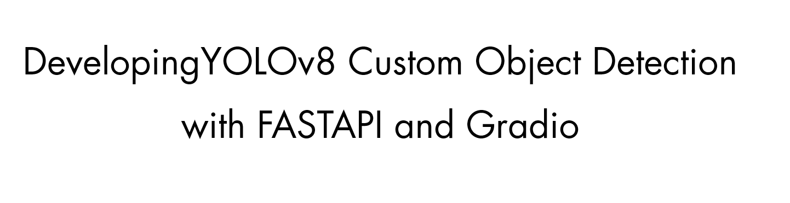

---

**A detailed tutorial covering the code in this repository:** [Coloring Black and White photos with Neural Networks](https://emilwallner.medium.com/colorize-b-w-photos-with-a-100-line-neural-network-53d9b4449f8d)

👉 Check out my [Huggingface app](https://huggingface.co/spaces/youssefboutaleb/Yolov8_meter) to test the model online. 

## run it using Dockerfile 
```
# Assuming you have Docker installed
docker build -t your-image-name .
docker run -p 8080:8080 your-image-name
```
## Installation 
if you want to use anaconda environment , you can use `base_environment.yml` :
```
conda env create --name yolo --file=base_environment.yml
```
Else, you can use a virtual environment and install the necessary libs by `requirements.txt` :
```
pip install -r requirements.txt
```

## Cloning and Navigating
```
git clone https://github.com/youssefboutaleb/yolov8_fastapi_gradio.git
cd yolov8_fastapi_gradio/
```

## running 
```
python3 main.py
```
## Deployment 
you can deploy the application for free :
- with vercel :you can use the `vercel.json` 
- with render : you can use the `Dockerfile` 
 
**Implementation details:**
- With two 15GB TPU, you can fit 10000 images using yolov8 large . 
- The learning improved a magnitude faster on the 256x256 images compared to the 1024x1024 images.
- with yolov8 large I've use `100` epochs and `32` batch size  . 
- If you want to build your own dataset, I've included a few scraping and cleaning scripts in `download_and_clean_data_scripts`. 
- I've implemented it for multi-gpu, however, all the models are copied on each GPU. . I'd recommend specifying on which GPU each model is loaded, to avoid merging the weights for each batch.


 